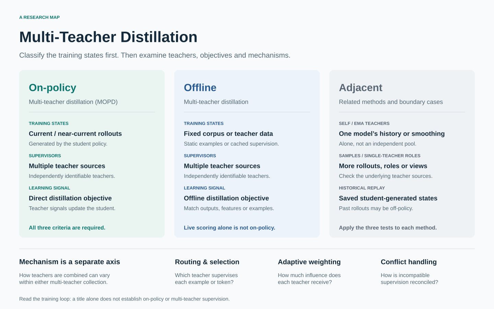

# Awesome Multi-Teacher Distillation 

Multi-teacher distillation transfers knowledge from several complementary or specialized models into one student. On-policy variants train on states generated by the student itself.

[中文](README_zh-CN.md)

## Contents

- [Start Here](#start-here)
- [Scope](#scope)
- [Multi-Teacher On-Policy Distillation](#multi-teacher-on-policy-distillation)
- [Offline Multi-Teacher Distillation](#offline-multi-teacher-distillation)
- [Adjacent and Alternative Paradigms](#adjacent-and-alternative-paradigms)
- [Single-Teacher Foundations](#single-teacher-foundations)
- [Reviews and Tutorials](#reviews-and-tutorials)

## Start Here

| Goal                            | Starting point                                                                                                                                 |
| ------------------------------- | ---------------------------------------------------------------------------------------------------------------------------------------------- |
| Learn the field                 | [Field Guide](resources/guide.md): three evidence tests, a method comparison, and an eight-paper route.                                        |
| Explore a research problem      | [Reading Paths](resources/reading-order.md): routing, capability consolidation, heterogeneous models, and offline distillation.                |
| Find implementations and models | [Author-Linked Artifacts](views/with-artifacts.md): code, models, datasets, and project pages; availability does not imply reproduced results. |

Use the selected papers below for an overview. The full catalogs and cross-cutting views are linked in [Footnotes](#footnotes).

## Scope

A work belongs to the strict MOPD collection when the current or near-current student generates the training states, multiple independently identifiable teachers provide supervision, and those signals directly update the student through a distillation objective. Static teacher data belongs to offline multi-teacher distillation; peers, self/EMA teachers, privileged views, sibling rollouts, and replay-based alternatives are labeled as adjacent unless they satisfy all three tests.

Every record has exactly one primary collection. Record type, training regime, state source, teacher topology, combination mechanism, supervision signal, and domain are independent facets, so a system report is no longer treated as a competing method category. The snapshot contains 134 records: 63 multi-teacher on-policy works, 50 offline multi-teacher works, 13 adjacent or alternative works, 3 single-teacher foundations, and 5 reviews or tutorials. The latest incremental search and verification pass was completed on 2026-10-05; new entries were checked against primary metadata and relevant method sections.

MOPD means multi-teacher on-policy distillation in this repository. Multi-rollout OPD is written as MR-OPD. Parameter merging, inference-only ensembles, ordinary mixture-of-experts routing, multi-agent debate without student training, and reward-only reinforcement learning are outside strict MOPD.

## Multi-Teacher On-Policy Distillation

- [From Gradients to Capabilities: Understanding Multi-Teacher On-Policy Distillation](https://arxiv.org/abs/2610.02179) - Analyzes how objectives, optimizer momentum, and numerical choices turn teacher signals into capability gains.
- [Latent-MOPD: Latent Multi-Teacher On-Policy Distillation](https://arxiv.org/abs/2610.02381) - Adds specialist hidden-state alignment and per-teacher crossfade schedules to token-level OPD.
- [Slow-Fast Multi-Teacher On-Policy Distillation for Capability Preservation](https://arxiv.org/abs/2610.02324) - Uses a slow EMA reference to reduce conflicts among independently specialized visual teachers.
- [Beyond Teacher Assignment: Domain-Normalized Multi-Teacher On-Policy Distillation](https://arxiv.org/abs/2609.35347) - Normalizes domain feedback scales while retaining simple domain-label teacher routing.
- [No Pain, More Gain: Iterative Merging for Effective Multi-Teacher On-Policy Distillation](https://arxiv.org/abs/2609.34745) - Interleaves MOPD with validation-triggered parameter corrections from under-recovered teachers.
- [PMOPD: Task Ordering, Cycling, and Parameter-Update Subspace Protection in Multi-Teacher On-Policy Distillation](https://arxiv.org/abs/2609.34605) - Protects task-update subspaces while cycling through ordered multi-teacher distillation blocks.
- [MOPD-Router: Rethinking Teacher Routing in Multi-Teacher On-Policy Distillation](https://arxiv.org/abs/2609.30837) - Compares token-level routing over the teacher pool using sampled-token teaching advantages.
- [Distill What You Trust: Reliability-Aware Multi-Teacher On-Policy Distillation](https://arxiv.org/abs/2609.23697) - Weights teacher losses using calibrated specialization relative to a shared reference model.
- [ACLArena: Agent Continue Learning in Multi-stage Post-training](https://arxiv.org/abs/2609.23989) - Compares mixed-KL MOPD, replay, and merging for retention across sequential agent-training stages.
- [Open-MOPD: Diagnosing and Fixing Capability Imbalance in Multi-Teacher On-Policy Distillation](https://arxiv.org/abs/2608.19098) - Provides an open recipe for diagnosing and balancing capability budgets in MOPD.
- [MOPD: Multi-Teacher On-Policy Distillation for Capability Integration in LLM Post-Training](https://arxiv.org/abs/2606.30406) - Formalizes specialist-to-generalist consolidation with teacher supervision on student trajectories.
- [Qwen-Image-2.0-RL Technical Report](https://arxiv.org/abs/2606.27608) - Distills image-generation and editing specialists by matching velocity fields on student trajectories.

## Offline Multi-Teacher Distillation

- [Med-RADIO: Reducing All Medical Domains Into One via Multi-Teacher Distillation](https://arxiv.org/abs/2609.37682) - Aligns a medical generalist and modality-specific teachers through normalized feature matching.
- [SoFT: Soft Targets for Generalizable LLM Fine-Tuning](https://arxiv.org/abs/2609.32493) - Uses soft targets to learn from fixed multi-teacher demonstrations while preserving base-model behavior.
- [Decision Shifts, Lost Label Functionality, and an Inconclusive Grounding Audit in Correctness-Gated Multi-Teacher Distillation](https://arxiv.org/abs/2609.09702) - Shows how correctness-gated distillation gains can coexist with lost label recall and inconclusive grounding evidence.
- [Multi-Teacher Knowledge Distillation via Teacher-Informed Mixture Priors](https://arxiv.org/abs/2605.27967) - Combines teacher-informed Bayesian mixture priors with sample-wise entropy weighting.
- [Merge-of-Thought Distillation](https://arxiv.org/abs/2509.08814) - Alternates teacher-specific rationale distillation with merging of trained student branches.
- [Find Your Optimal Teacher: Personalized Data Synthesis via Router-Guided Multi-Teacher Distillation](https://aclanthology.org/2026.acl-long.666/) - Routes prompts by both teacher response quality and student learnability for personalized data synthesis.
- [Exploring Knowledge Purification in Multi-Teacher Knowledge Distillation for LLMs](https://arxiv.org/abs/2602.01064) - Purifies conflicting teacher rationales into one training rationale and studies alternative routing strategies.
- [Beyond Answers: Transferring Reasoning Capabilities to Smaller LLMs Using Multi-Teacher Knowledge Distillation](https://arxiv.org/abs/2402.04616) - Transfers answers and rationales from several language-model teachers into a smaller student.
- [AM-RADIO: Agglomerative Vision Foundation Model — Reduce All Domains Into One](https://arxiv.org/abs/2312.06709) - Agglomerates complementary vision-foundation-model representations into one efficient visual encoder.
- [Learning from Multiple Teacher Networks](https://dl.acm.org/doi/10.1145/3097983.3098135) - Seminal multi-teacher method that transfers averaged dark knowledge and intermediate relations.

## Adjacent and Alternative Paradigms

- [ROSS: Relearning from Self-Generated Rollouts through Selective Supervision](https://arxiv.org/abs/2609.35954) - Selectively relearns saved RL and MOPD rollouts through offline masked supervision.
- [MAS-OPD: On-Policy Distillation for Multi-agent Systems](https://arxiv.org/abs/2609.34234) - Distills interacting agents from role-conditioned views of one frozen teacher.
- [RISE: Recursive Improvement via Self-Extrapolating Policy Distillation](https://arxiv.org/abs/2609.05295) - Extrapolates a dense self-teacher from the current and trailing checkpoints rather than using independent teachers.
- [DOPD: Dual On-policy Distillation](https://arxiv.org/abs/2606.30626) - Routes supervision between privileged teacher and privileged student views rather than an independent teacher pool.
- [Skill-Conditioned Gated Self-Distillation for LLM Reasoning](https://arxiv.org/abs/2605.28791) - Treats several skill-conditioned views of one live policy as a gated self-teacher pool.
- [Multi-Rollout On-Policy Distillation via Peer Successes and Failures](https://arxiv.org/abs/2605.12652) - Builds teacher signals from sibling rollouts; “multi” refers to rollouts rather than independent teachers.

## Single-Teacher Foundations

- [DistiLLM: Towards Streamlined Distillation for Large Language Models](https://arxiv.org/abs/2402.03898) - Introduces skew-KL objectives and an efficient hybrid online distillation pipeline.
- [On-Policy Distillation of Language Models: Learning from Self-Generated Mistakes](https://arxiv.org/abs/2306.13649) - Formalizes distillation on student-generated sequences and unifies several divergence objectives.
- [MiniLLM: Knowledge Distillation of Large Language Models](https://arxiv.org/abs/2306.08543) - Develops reverse-KL generative distillation with student-sampled behavior and stabilization methods.

## Reviews and Tutorials

- [A Survey of On-Policy Distillation for Large Language Models](https://arxiv.org/abs/2604.00626) - Reviews OPD objectives, signal sources, stabilization, systems, and applications.
- [Knowledge Distillation for Language Models](https://aclanthology.org/2025.naacl-tutorial.4/) - Tutorial covering prediction and representation matching, reinforcement-learning-based KD, and multi-teacher methods.
- [A Survey on Knowledge Distillation of Large Language Models](https://arxiv.org/abs/2402.13116) - Surveys knowledge elicitation and white-box and black-box distillation for language models.
- [Knowledge Distillation: A Survey](https://arxiv.org/abs/2006.05525) - Organizes response-, feature-, and relation-based knowledge across training schemes and applications.

## Contributing

Suggestions and corrections are welcome. Please read the [contribution guide](CONTRIBUTING.md) before opening an issue or pull request.

## Footnotes

The complete canonical catalogs cover [multi-teacher on-policy distillation](papers/multi-teacher-on-policy.md), [offline multi-teacher distillation](papers/offline-multi-teacher.md), [adjacent and alternative paradigms](papers/adjacent-alternatives.md), [single-teacher foundations](papers/single-teacher-foundations.md), and [reviews and tutorials](papers/reviews-tutorials.md).

Cross-cutting views are available by [mechanism](views/by-mechanism.md), [teacher topology](views/by-teacher-topology.md), [supervision signal](views/by-supervision-signal.md), [domain](views/by-domain.md), [system report](views/system-reports.md), and [first public date](views/chronological.md).

For maintenance and reproducibility, see the [machine-readable catalog](data/papers.json), [schema](data/schema.json), [taxonomy](resources/taxonomy.md), [open research questions](resources/open-questions.md), and [search and verification protocol](resources/search-strategy.md).

See the [October search record](resources/update-2026-10-05.md) for sources and classification boundaries, and the [Awesome submission audit](resources/awesome-submission.md) before proposing this list to the main index.
