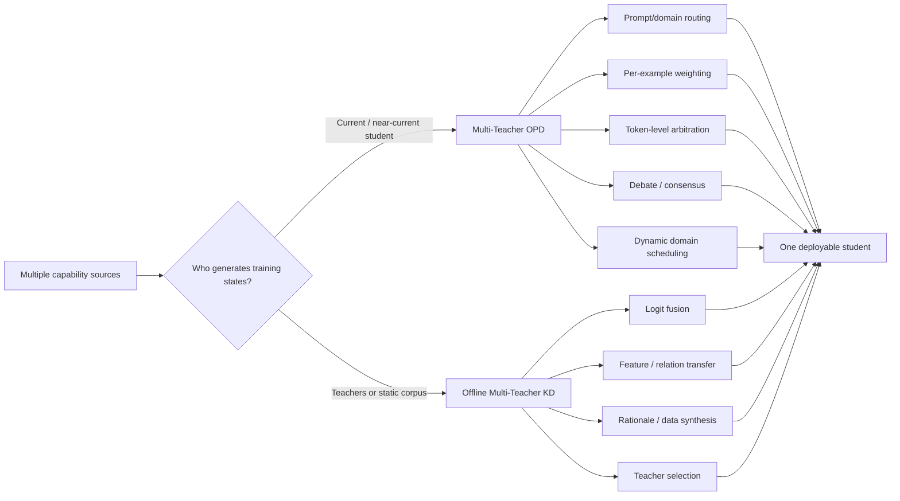

# Awesome Multi-Teacher Distillation

Methods for transferring complementary, conflicting, or specialized capabilities from multiple teachers into one student, with an emphasis on **Multi-Teacher On-Policy Distillation (MOPD)**.

[中文](README_zh-CN.md) · [Complete MOPD catalog](papers/multi-teacher-opd.md) · [Multi-teacher KD catalog](papers/general-multi-teacher-distillation.md) · [Reading guide](resources/reading-order.md)

## Contents

- [Scope and terminology](#scope-and-terminology)
- [Taxonomy](#taxonomy)
- [Latest additions](#latest-additions)
- [Essential reading](#essential-reading)
- [Core MOPD papers](#core-mopd-papers)
- [Systems and applications](#systems-and-applications)
- [Adjacent online paradigms](#adjacent-online-paradigms)
- [General multi-teacher distillation](#general-multi-teacher-distillation)
- [Foundations, surveys, and tutorials](#foundations-surveys-and-tutorials)
- [Code and frameworks](#code-and-frameworks)
- [Open research questions](#open-research-questions)
- [Data and maintenance](#data-and-maintenance)
- [Contributing](#contributing)

## Scope and terminology

This repository uses a deliberately strict definition. A work is marked **strict MOPD** only when all three conditions hold:

1. the student, or a near-current copy of it, generates the training trajectory/state;
2. at least two independent teachers, expert checkpoints, teacher views, or peer policies provide supervision; and
3. those teacher signals directly update the student through a divergence, sampled-token advantage, representation/field target, or an equivalent training objective.

The catalog separates five regimes:

| Label | Meaning |
|---|---|
| **MOPD** | Strict multi-teacher on-policy distillation. |
| **System** | A technical report or deployed model in which MOPD is a material training stage. |
| **Adjacent** | Co-distillation, multi-view/self-teacher methods, or explicit offline alternatives to MOPD. |
| **MTKD** | Multi-teacher knowledge distillation on static teacher data, logits, features, or rationales. |
| **Foundation** | Single-teacher OPD, policy distillation, surveys, and tutorials needed to understand MOPD. |

In this repository, **MOPD always means Multi-Teacher OPD**. Multi-Rollout OPD is written as **MR-OPD** to avoid acronym collision. Pure model merging, inference-only ensembles, mixture-of-experts routing, multi-agent debate without student training, and reward-only RL are not labeled MOPD.

All entries were checked against a primary paper page, official proceedings page, official project, or author code repository. Preprints are not presented as peer-reviewed work.

The 2026-08-31 snapshot contains **21 core MOPD papers, 20 system/application reports, 6 adjacent online works, 39 offline multi-teacher KD papers, and 9 foundations/surveys/tutorials** (95 unique records).

## Taxonomy

The detailed axes—teacher topology, routing granularity, aggregation, signal type, objective, scheduling, and failure modes—are described in the [taxonomy notes](resources/taxonomy.md).

## Latest additions

Verified through **2026-08-31**.

| Date | Paper | Why it matters |
|---|---|---|
| 2026-08-27 | [Consolidating RLVR Capabilities Across Domains](https://arxiv.org/abs/2608.27409) | Controlled head-to-head comparison of Merge, Mix RL, and MOPD. |
| 2026-08-27 | [Uncertainty-Calibrated MOPD](https://arxiv.org/abs/2608.26735) | Filters trajectories and token updates using positive advantage and entropy-calibrated endorsement. |
| 2026-08-25 | [D$^3$-MOPD](https://arxiv.org/abs/2608.24987) | Adapts the domain mixture online from each domain's KL trajectory. |
| 2026-08-19 | [Open-MOPD](https://arxiv.org/abs/2608.19098) | End-to-end open MOPD recipe with models, data, training, and evaluation artifacts. |
| 2026-08-17 | [Every Coin Has Two Sides](https://arxiv.org/abs/2608.16647) | Diagnoses broad transfer and capability seesaws in multi-teacher settings. |

## Essential reading

1. [Policy Distillation](https://arxiv.org/abs/1511.06295) — early multi-policy-to-one-student precursor.
2. [On-Policy Distillation of Language Models: Learning from Self-Generated Mistakes](https://arxiv.org/abs/2306.13649) — modern LLM OPD foundation.
3. [MiMo-V2-Flash Technical Report](https://arxiv.org/abs/2601.02780) — an early frontier report to explicitly formulate MOPD.
4. [MOPD: Multi-Teacher On-Policy Distillation](https://arxiv.org/abs/2606.30406) — canonical general method and capability-integration study.
5. [Open-MOPD](https://arxiv.org/abs/2608.19098) — reproducible recipe and optimization-budget diagnosis.
6. [D$^3$-MOPD](https://arxiv.org/abs/2608.24987) — dynamic scheduling and training efficiency.
7. [Consolidating RLVR Capabilities Across Domains](https://arxiv.org/abs/2608.27409) — evidence-based choice among three expert-fusion paradigms.

For reading paths tailored to LLM post-training, agents, multimodal generation, or classical MTKD, see the [reading guide](resources/reading-order.md).

## Core MOPD papers

Papers are sorted by first public date. `—` means that no official code or project link was verified at the cutoff date.

| Paper | Date | Teachers → student | Core mechanism | Resources |
|---|:---:|---|---|---|
| [Consolidating RLVR Capabilities Across Domains](https://arxiv.org/abs/2608.27409) | 2026-08 | Domain RLVR experts → generalist | Controlled comparison of MOPD, parameter merge, and mixed RL | [Code](https://github.com/Di-viner/LLM-Fusion) |
| [Uncertainty-Calibrated MOPD](https://arxiv.org/abs/2608.26735) | 2026-08 | Domain + general teachers → specialized student | Dual-temperature rollout sampling and entropy-calibrated token filtering | — |
| [D$^3$-MOPD](https://arxiv.org/abs/2608.24987) | 2026-08 | Four domain teachers → Qwen3.6-35B-A3B | KL-trajectory-based asynchronous domain scheduler | — |
| [Open-MOPD](https://arxiv.org/abs/2608.19098) | 2026-08 | Math + code + IF teachers → SmolLM3-3B | Token-share balancing, gap-aware budgets, reward refresh | [Code](https://github.com/BytedTsinghua-SIA/Open-MOPD) · [Project](https://bytedtsinghua-sia.github.io/Open-MOPD/) |
| [Every Coin Has Two Sides](https://arxiv.org/abs/2608.16647) | 2026-08 | Multiple routed domain teachers → LLM | Controlled generalization study and mixture-dependent seesaw diagnosis | — |
| [Poly-OPD](https://arxiv.org/abs/2608.04349) | 2026-08 | FLUX.1-dev + Z-Image → SD3.5-Medium | Pixel bridge, compatibility-aware adapters, gap-aware curriculum | — |
| [Language-Specialized MOPD](https://arxiv.org/abs/2608.03610) | 2026-08 | Ranked language RL teachers → multilingual ASR student | Language routing and weighted top-$K$ reverse-KL | — |
| [SMOPD](https://arxiv.org/abs/2608.03092) | 2026-08 | Reward-specialized policies → unified policy | Specialize first; merge through online policy distillation | — |
| [Beyond the Best Teacher / TU-OPD](https://arxiv.org/abs/2607.27770) | 2026-07 | Complementary RGRPO teachers → Qwen3-1.7B | Reliability-gated teacher union and consensus-residual decomposition | — |
| [The Physics of Multi-Turn Long-Horizon Planning](https://arxiv.org/abs/2607.24720) | 2026-07 | Environment specialists → planning agent | Studies shared, partial, and conflicting planning-pattern integration | [Code](https://github.com/Quester-one/PlanPhysCode) · [Project](https://quester-one.github.io/PlanPhysWebsite/) |
| [When Top-K Misses the Decision](https://arxiv.org/abs/2607.07050) | 2026-07 | Tool + response teachers → tool-use student | Causal audit of decision-critical support omitted by top-$K$ logits | [Code](https://github.com/shen-jiabin/decision-support-opd) |
| [UI-MOPD](https://arxiv.org/abs/2607.04425) | 2026-07 | Desktop + mobile teachers → unified GUI agent | Platform-conditioned rollout routing | [Code](https://github.com/EliSpectre/UI-MOPD) · [Project](https://elispectre.github.io/UI-MOPD/) |
| [H-OPD](https://arxiv.org/abs/2607.02592) | 2026-07 | VLM + text-only teachers → multimodal reasoner | Token-level confidence arbitration across heterogeneous teachers | [Code](https://github.com/buptyqx/H-OPD) |
| [Scaling the Horizon, Not the Parameters / Agents-A1](https://arxiv.org/abs/2606.30616) | 2026-06 | Six agent-domain teachers → 35B agent | Domain routing with salient-vocabulary alignment | — |
| [MOPD](https://arxiv.org/abs/2606.30406) | 2026-06 | Domain RL teachers → Qwen3-30B-A3B | Routed reverse-KL on student rollouts for capability integration | — |
| [DanceOPD](https://arxiv.org/abs/2606.27377) | 2026-06 | T2I/editing capability fields → unified flow model | Capability routing on student-induced states with velocity matching | — |
| [Counteraction-Aware MOPD](https://arxiv.org/abs/2605.27115) | 2026-05 | Domain + general teachers → specialized LLM | Alternating updates and gap-based selection under incomplete coverage | — |
| [CollectionLoRA](https://arxiv.org/abs/2605.25378) | 2026-05 | 50–180 effect LoRAs → one LoRA | Dual-stream routing, prompt isolation, coarse-to-fine objective | [Code](https://github.com/Qwen-Applications/CollectionLoRA) · [Project](https://collectionlora.github.io/) |
| [ProteinOPD](https://arxiv.org/abs/2605.10189) | 2026-05 | Preference-specific protein teachers → shared PLM | Weighted geometric teacher consensus under conflicts | [Code](https://github.com/THU-AI4S/ProteinOPD) |
| [Uni-OPD](https://arxiv.org/abs/2605.03677) | 2026-05 | Single/multiple LLM or MLLM teachers → student | Student exploration plus outcome-consistent teacher calibration | [Code](https://github.com/WenjinHou/Uni-OPD) |
| [MAD-OPD](https://arxiv.org/abs/2605.01347) | 2026-05 | Debating teacher collective → LLM/agent student | Confidence-weighted debate supervision and step-level OPAD | [Code](https://github.com/chiefovoavicii/MAD-OPD) |

The [complete MOPD catalog](papers/multi-teacher-opd.md) also includes industrial reports, application papers, model artifacts, and the exact evidence used for classification.

## Systems and applications

The industrial literature is unusually important here: several frontier-model reports used MOPD before or alongside dedicated method papers.

| System | Date | MOPD role | Domain |
|---|:---:|---|---|
| [Swift-Image](https://arxiv.org/abs/2608.20334) | 2026-08 | Consolidates parallel generation/editing RL experts | Image generation |
| [Mint-Agent](https://arxiv.org/abs/2608.16386) | 2026-08 | Merges finance-reasoning and agent-execution experts | Finance agents |
| [SocialRL](https://arxiv.org/abs/2608.13787) | 2026-08 | Consolidates six negotiation-domain policies | Social agents |
| [Motif 3](https://arxiv.org/abs/2608.09119) | 2026-08 | Unifies six RL specialists and one SWE teacher | Frontier LLM |
| [Kimi K3](https://arxiv.org/abs/2607.24653) | 2026-07 | Consolidates nine domain × reasoning-effort policies | Frontier LLM |
| [Solar Open 2](https://arxiv.org/abs/2607.20062) | 2026-07 | Consolidates twelve domain specialists | Long-context agents |
| [Mach-Mind-4-Flash](https://arxiv.org/abs/2607.09375) | 2026-07 | Dynamically scheduled routed reverse-KL across three tracks | Agentic LLM |
| [KAT-Coder-V2.5](https://arxiv.org/abs/2607.05471) | 2026-07 | Unifies SWE, Agent-Claw, and WebCoding experts | Coding agents |
| [DeepSeek-V4](https://arxiv.org/abs/2606.19348) | 2026-04 | Full-vocabulary MOPD across independently trained experts | Frontier LLM |
| [Nemotron 3 Ultra](https://arxiv.org/abs/2606.15007) | 2026-06 | Consolidates more than ten specialist teachers | Frontier LLM |
| [Kwai Keye-VL-2.0](https://arxiv.org/abs/2606.10651) | 2026-06 | Cross-modal MOPD paired with context/video RL | Multimodal agents |
| [OneReason](https://arxiv.org/abs/2606.06260) | 2026-06 | Specialize-then-unify across recommendation domains | Recommender systems |
| [Nemotron-Cascade 2](https://arxiv.org/abs/2603.19220) | 2026-03 | Multi-domain OPD between Cascade RL stages | Reasoning/agents |
| [GLM-5](https://arxiv.org/abs/2602.15763) | 2026-02 | Cross-stage OPD from earlier SFT/RL checkpoints | Agentic LLM |
| [Baichuan-M3](https://arxiv.org/abs/2602.06570) | 2026-02 | Final reverse-KL MOPD after task RL and offline FKL | Medical LLM |
| [MiMo-V2-Flash](https://arxiv.org/abs/2601.02780) | 2026-01 | Introduces the named MOPD post-training stage | Frontier LLM |

Additional systems—including Capek 0.5, Cross-Domain Hybrid OPD, KAT-Coder-V2, and ORBIT—are indexed in the [complete catalog](papers/multi-teacher-opd.md).

## Adjacent online paradigms

These papers are highly relevant but do not match the repository's strict “independent multi-teacher pool” definition.

| Paper | Relation to MOPD |
|---|---|
| [REGEN](https://arxiv.org/abs/2607.19450) | Recycles specialist RL replay buffers with offline RL as a lower-cost alternative to coupled MOPD. |
| [DOPD](https://arxiv.org/abs/2606.30626) | Routes tokens between a privileged teacher and privileged student policy. |
| [Be My Tutor / OPCoD](https://arxiv.org/abs/2606.14368) | Two peers mutually improve through feedback-conditioned on-policy co-distillation. |
| [Multi-Rollout OPD](https://arxiv.org/abs/2605.12652) | Builds teacher signals from sibling successes/failures; multiple rollouts, not independent teachers. |
| [CoDistill-GRPO](https://arxiv.org/abs/2605.08873) | Two trainable policies learn bidirectionally inside GRPO. |
| [UniSD](https://arxiv.org/abs/2605.06597) | Self-distillation with EMA teachers and multi-teacher agreement. |

See [adjacent paradigms](papers/adjacent-paradigms.md) for boundary cases and exclusion notes.

## General multi-teacher distillation

Representative off-policy and static-data multi-teacher work:

| Paper | Venue / year | Main idea |
|---|---|---|
| [Learning from Multiple Teacher Networks](https://dl.acm.org/doi/10.1145/3097983.3098135) | KDD 2017 | Transfers averaged dark knowledge and intermediate inter-example relations. |
| [Two-stage Multi-teacher KD for Web QA](https://arxiv.org/abs/1910.08381) | WSDM 2020 | General QA distillation followed by task-specific multi-teacher fine-tuning. |
| [Agree to Disagree](https://proceedings.neurips.cc/paper/2020/hash/91c77393975889bd08f301c9e13a44b7-Abstract.html) | NeurIPS 2020 | Resolves teacher conflicts as multi-objective optimization in gradient space. |
| [One Teacher is Enough? / MT-BERT](https://arxiv.org/abs/2106.01023) | Findings of ACL 2021 | Co-finetunes PLM teachers and distills hidden states plus soft labels. |
| [PILE](https://aclanthology.org/2022.emnlp-industry.60/) | EMNLP Industry 2022 | Label-guided pairwise iterative teacher-logit ensembling. |
| [Multilingual Spelling Correction](https://aclanthology.org/2023.emnlp-industry.15/) | EMNLP Industry 2023 | Monolingual locale teachers into one multilingual student. |
| [FuseLLM](https://arxiv.org/abs/2401.10491) | ICLR 2024 | Aligns and fuses generative distributions from heterogeneous LLMs. |
| [GOVERN](https://aclanthology.org/2024.emnlp-industry.120/) | EMNLP Industry 2024 | Gradient-orientation voting for label-free teacher aggregation. |
| [FuseChat](https://arxiv.org/abs/2408.07990) | 2024 | Cross-tokenizer knowledge fusion followed by parameter merging. |
| [Knowledge Purification for Multi-Teacher LLM KD](https://arxiv.org/abs/2602.01064) | 2026 | Consolidates conflicting teacher rationales before student training. |
| [Find Your Optimal Teacher / PerSyn](https://aclanthology.org/2026.acl-long.666/) | ACL 2026 | Routes prompts by both teacher quality and student learnability. |

The [full multi-teacher KD catalog](papers/general-multi-teacher-distillation.md) additionally covers adaptive multi-level KD, quantization, continual learning, multimodal retrieval, and pathology.

## Foundations, surveys, and tutorials

| Resource | Year | Use |
|---|:---:|---|
| [Distilling the Knowledge in a Neural Network](https://arxiv.org/abs/1503.02531) | 2015 | Temperature-scaled KD and ensemble-to-student foundation. |
| [Policy Distillation](https://arxiv.org/abs/1511.06295) | 2015 | Multi-policy compression and multi-task transfer precursor. |
| [Knowledge Distillation: A Survey](https://arxiv.org/abs/2006.05525) | 2020 | General KD taxonomy. |
| [MiniLLM](https://arxiv.org/abs/2306.08543) | 2023 | Reverse-KL generative LLM distillation. |
| [GKD](https://arxiv.org/abs/2306.13649) | 2023 | Student-generated on-policy sequences and generalized divergences. |
| [DistiLLM](https://arxiv.org/abs/2402.03898) | 2024 | Skew-KL and efficient online LLM distillation. |
| [A Survey on Knowledge Distillation of LLMs](https://arxiv.org/abs/2402.13116) | 2024 | White-box, black-box, and capability-oriented LLM KD. |
| [Knowledge Distillation for Language Models](https://aclanthology.org/2025.naacl-tutorial.4/) | 2025 | NAACL tutorial, including RL-based and multi-teacher KD. |
| [A Survey of On-Policy Distillation for LLMs](https://arxiv.org/abs/2604.00626) | 2026 | Comprehensive modern OPD taxonomy and method survey. |

## Code and frameworks

| Project | What it provides |
|---|---|
| [Open-MOPD](https://github.com/BytedTsinghua-SIA/Open-MOPD) | End-to-end mixed SFT → domain RL teachers → MOPD recipe, models, data, and evaluation. |
| [NVIDIA NeMo RL: MOPD](https://github.com/NVIDIA-NeMo/RL/blob/main/docs/about/algorithms/mopd.md) | Async GRPO-based MOPD with teacher routing, sampled-token advantages, and multi-node recipes. |
| [LoongSage](https://github.com/baidu-baige/LoongSage) | Production-oriented agentic RL framework with full-vocabulary multi-teacher MOPD recipes. |
| [MiMo-V2-Flash](https://github.com/XiaomiMiMo/MiMo-V2-Flash) | Official technical report, model links, and artifacts for an early named frontier MOPD pipeline. |
| [MAD-OPD](https://github.com/chiefovoavicii/MAD-OPD) | Multi-agent debate-driven OPD implementation. |
| [Uni-OPD](https://github.com/WenjinHou/Uni-OPD) | Reliability-calibrated OPD across LLM and MLLM settings. |
| [CollectionLoRA](https://github.com/Qwen-Applications/CollectionLoRA) | Multi-teacher OPD for consolidating image-editing LoRAs. |
| [ProteinOPD](https://github.com/THU-AI4S/ProteinOPD) | Multi-objective protein preference alignment. |
| [PlanPhysCode](https://github.com/Quester-one/PlanPhysCode) | Controlled long-horizon planning and MOPD experiments. |
| [REGEN](https://github.com/yunjie-sysu/REGEN) | Offline replay-recycling alternative to MOPD. |

## Open research questions

- **Teacher construction:** How should complementary teachers be produced rather than merely selected after independent RL runs?
- **Routing granularity:** When should routing happen per domain, prompt, trajectory, step, token, vocabulary coordinate, or latent field?
- **Capability balance:** How should token length, convergence rate, stale rewards, and unequal headroom determine each domain's optimization budget?
- **Conflict and generalization:** How can a student preserve specialist modes without inheriting cross-domain seesaws or destructive teacher interference?
- **Approximate supervision:** When do top-$K$ logits, sampled-token rewards, quantized teachers, and asynchronous policies preserve the full-vocabulary update direction?
- **Heterogeneous teachers:** How can MOPD cross tokenizer, architecture, modality, autoencoder, action-space, and model-lineage boundaries?
- **Evaluation:** What benchmark reports capability inheritance, retention, calibration, diversity, cost, and routing failure in one reproducible protocol?
- **Theory:** Under what conditions can a student exceed every teacher, and when is it necessarily bounded by the teacher union?

## Data and maintenance

- [`data/papers.json`](data/papers.json) is the machine-readable catalog with 95 verified entries.
- [`data/schema.json`](data/schema.json) specifies required fields and controlled labels.
- [`resources/search-strategy.md`](resources/search-strategy.md) records queries, sources, cutoff date, and inclusion/exclusion rules.
- Run `python3 scripts/validate.py` to catch malformed metadata, duplicate identifiers/URLs, invalid categories, date errors, and missing catalog coverage.
- New discoveries should enter [`papers/pending.md`](papers/pending.md) until the paper itself and any claimed code link are checked.

## Contributing

Contributions are welcome. Please read [CONTRIBUTING.md](CONTRIBUTING.md), use the paper-addition issue form, and include a primary source plus enough method detail to decide whether the work is strict MOPD, a system application, adjacent, or offline MTKD.

The repository is organized around independently verified primary sources, explicit boundary labels, machine-readable provenance, duplicate checks, and a bilingual entry point.

To submit this list to the official Awesome index, maintainers should first perform an independent human review of every entry and follow the current [Awesome list requirements](https://github.com/sindresorhus/awesome/blob/main/pull_request_template.md). The repository content is released under [CC0-1.0](LICENSE).
