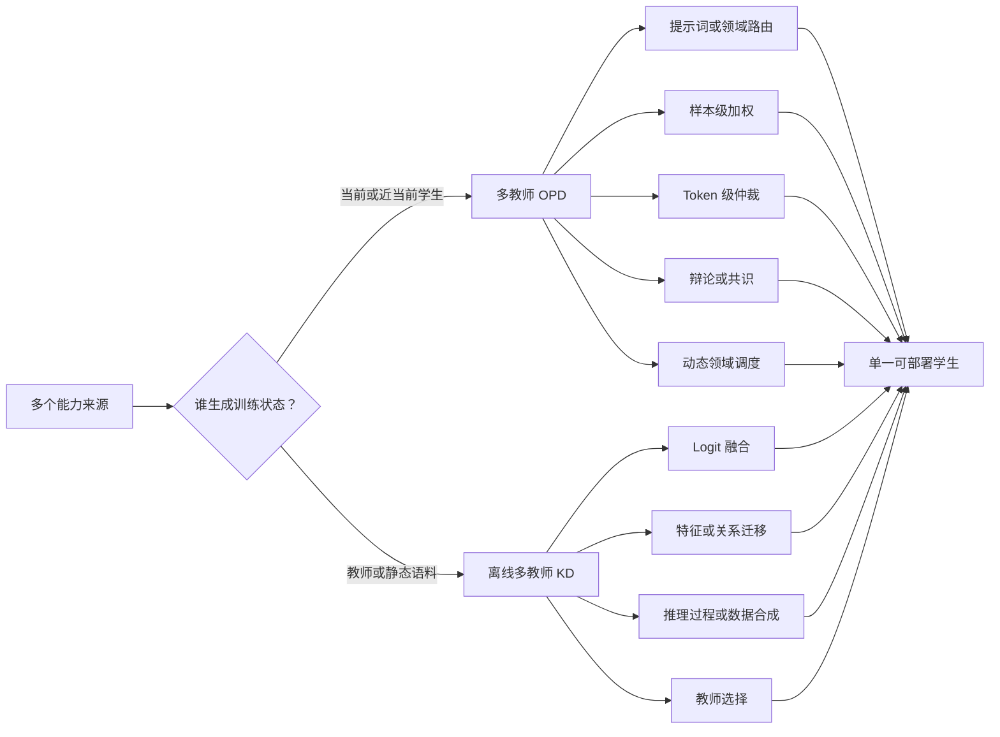

# Awesome Multi-Teacher Distillation

汇集将多个教师所具备的互补、冲突或专门化能力迁移到单一学生模型的方法，重点关注**多教师在策略蒸馏（Multi-Teacher On-Policy Distillation，MOPD）**。

[English](README.md) · [完整 MOPD 目录](papers/multi-teacher-opd.md) · [多教师 KD 目录](papers/general-multi-teacher-distillation.md) · [阅读指南](resources/reading-order.md)

## 目录

- [范围与术语](#范围与术语)
- [方法分类](#方法分类)
- [最新收录](#最新收录)
- [必读论文](#必读论文)
- [核心 MOPD 论文](#核心-mopd-论文)
- [系统与应用](#系统与应用)
- [相邻的在线范式](#相邻的在线范式)
- [通用多教师蒸馏](#通用多教师蒸馏)
- [基础工作、综述与教程](#基础工作综述与教程)
- [代码与框架](#代码与框架)
- [开放研究问题](#开放研究问题)
- [数据与维护](#数据与维护)
- [参与贡献](#参与贡献)

## 范围与术语

本仓库采用有意收紧的定义。只有同时满足以下三个条件的工作，才标记为**严格 MOPD**：

1. 训练轨迹或状态由学生模型（或与当前学生参数十分接近的副本）生成；
2. 至少两个相互独立的教师、专家检查点、教师视角或同伴策略提供监督；
3. 这些教师信号通过散度、采样 token 优势、表征/场目标或等价训练目标，直接用于更新学生模型。

目录将工作划分为五类：

| 标签 | 含义 |
|---|---|
| **MOPD** | 严格意义上的多教师在策略蒸馏。 |
| **System** | 将 MOPD 作为关键训练阶段的技术报告或已部署模型。 |
| **Adjacent** | 协同蒸馏、多视角/自教师方法，或明确以离线方案替代 MOPD 的工作。 |
| **MTKD** | 基于静态教师数据、logits、特征或推理过程的多教师知识蒸馏。 |
| **Foundation** | 理解 MOPD 所需的单教师 OPD、策略蒸馏、综述和教程。 |

在本仓库中，**MOPD 始终指 Multi-Teacher OPD**。为避免缩写冲突，Multi-Rollout OPD 统一写作 **MR-OPD**。纯模型合并、仅推理阶段的集成、混合专家路由、不训练学生模型的多智能体辩论，以及只提供奖励的强化学习，均不会被标记为 MOPD。

每个条目都已通过论文主页、正式会议页面、官方项目页或作者代码仓库进行核验。预印本不会被描述为已经同行评审的成果。

截至 2026-08-31，本仓库包含 **21 篇核心 MOPD、20 篇系统/应用报告、6 篇相邻在线工作、39 篇离线多教师 KD，以及 9 篇基础论文/综述/教程**，共 95 条不重复记录。

## 方法分类

更细的分析维度——教师拓扑、路由粒度、聚合方式、监督信号、训练目标、调度策略和失效模式——见[分类说明](resources/taxonomy.md)。

## 最新收录

核验截止日期：**2026-08-31**。

| 日期 | 论文 | 主要价值 |
|---|---|---|
| 2026-08-27 | [Consolidating RLVR Capabilities Across Domains](https://arxiv.org/abs/2608.27409) | 在受控条件下直接比较参数合并、混合 RL 与 MOPD。 |
| 2026-08-27 | [Uncertainty-Calibrated MOPD](https://arxiv.org/abs/2608.26735) | 使用正优势与熵校准的认可度，筛选轨迹和 token 更新。 |
| 2026-08-25 | [D$^3$-MOPD](https://arxiv.org/abs/2608.24987) | 根据各领域的 KL 变化轨迹在线调整领域采样混合。 |
| 2026-08-19 | [Open-MOPD](https://arxiv.org/abs/2608.19098) | 端到端开放的 MOPD 方案，同时提供模型、数据、训练与评测产物。 |
| 2026-08-17 | [Every Coin Has Two Sides](https://arxiv.org/abs/2608.16647) | 分析多教师场景中的广泛迁移与能力跷跷板现象。 |

## 必读论文

1. [Policy Distillation](https://arxiv.org/abs/1511.06295) — 早期将多个策略压缩进单一学生模型的先驱工作。
2. [On-Policy Distillation of Language Models: Learning from Self-Generated Mistakes](https://arxiv.org/abs/2306.13649) — 现代大语言模型 OPD 的基础工作。
3. [MiMo-V2-Flash Technical Report](https://arxiv.org/abs/2601.02780) — 较早明确提出 MOPD 的前沿模型技术报告。
4. [MOPD: Multi-Teacher On-Policy Distillation](https://arxiv.org/abs/2606.30406) — 通用 MOPD 方法及能力整合研究的代表作。
5. [Open-MOPD](https://arxiv.org/abs/2608.19098) — 可复现训练方案及优化预算问题分析。
6. [D$^3$-MOPD](https://arxiv.org/abs/2608.24987) — 动态调度与训练效率。
7. [Consolidating RLVR Capabilities Across Domains](https://arxiv.org/abs/2608.27409) — 为三种专家融合范式的选择提供实证依据。

面向大语言模型后训练、智能体、多模态生成或经典 MTKD 的不同阅读路径，请参阅[阅读指南](resources/reading-order.md)。

## 核心 MOPD 论文

论文按首次公开日期倒序排列。`—` 表示截至核验日期，尚未找到已确认的官方代码或项目链接。

| 论文 | 日期 | 教师 → 学生 | 核心机制 | 资源 |
|---|:---:|---|---|---|
| [Consolidating RLVR Capabilities Across Domains](https://arxiv.org/abs/2608.27409) | 2026-08 | 领域 RLVR 专家 → 通用模型 | 受控比较 MOPD、参数合并和混合 RL | [代码](https://github.com/Di-viner/LLM-Fusion) |
| [Uncertainty-Calibrated MOPD](https://arxiv.org/abs/2608.26735) | 2026-08 | 领域教师 + 通用教师 → 专用学生 | 双温度 rollout 采样与熵校准的 token 过滤 | — |
| [D$^3$-MOPD](https://arxiv.org/abs/2608.24987) | 2026-08 | 四个领域教师 → Qwen3.6-35B-A3B | 基于 KL 轨迹的异步领域调度器 | — |
| [Open-MOPD](https://arxiv.org/abs/2608.19098) | 2026-08 | 数学 + 代码 + 指令遵循教师 → SmolLM3-3B | Token 份额均衡、能力差距感知预算与奖励刷新 | [代码](https://github.com/BytedTsinghua-SIA/Open-MOPD) · [项目](https://bytedtsinghua-sia.github.io/Open-MOPD/) |
| [Every Coin Has Two Sides](https://arxiv.org/abs/2608.16647) | 2026-08 | 多个路由式领域教师 → LLM | 受控泛化研究与混合比例相关的能力跷跷板诊断 | — |
| [Poly-OPD](https://arxiv.org/abs/2608.04349) | 2026-08 | FLUX.1-dev + Z-Image → SD3.5-Medium | 像素桥、兼容性感知适配器与差距感知课程 | — |
| [Language-Specialized MOPD](https://arxiv.org/abs/2608.03610) | 2026-08 | 排序后的语言 RL 教师 → 多语言 ASR 学生 | 语言路由与加权 top-$K$ 反向 KL | — |
| [SMOPD](https://arxiv.org/abs/2608.03092) | 2026-08 | 奖励专门化策略 → 统一策略 | 先专门化，再通过在线策略蒸馏进行合并 | — |
| [Beyond the Best Teacher / TU-OPD](https://arxiv.org/abs/2607.27770) | 2026-07 | 互补 RGRPO 教师 → Qwen3-1.7B | 可靠性门控的教师并集与共识—残差分解 | — |
| [The Physics of Multi-Turn Long-Horizon Planning](https://arxiv.org/abs/2607.24720) | 2026-07 | 环境专家 → 规划智能体 | 研究共享、部分重合和互相冲突的规划模式整合 | [代码](https://github.com/Quester-one/PlanPhysCode) · [项目](https://quester-one.github.io/PlanPhysWebsite/) |
| [When Top-K Misses the Decision](https://arxiv.org/abs/2607.07050) | 2026-07 | 工具教师 + 响应教师 → 工具使用学生 | 审计 top-$K$ logits 遗漏关键决策支持的因果影响 | [代码](https://github.com/shen-jiabin/decision-support-opd) |
| [UI-MOPD](https://arxiv.org/abs/2607.04425) | 2026-07 | 桌面端 + 移动端教师 → 统一 GUI 智能体 | 平台条件化的 rollout 路由 | [代码](https://github.com/EliSpectre/UI-MOPD) · [项目](https://elispectre.github.io/UI-MOPD/) |
| [H-OPD](https://arxiv.org/abs/2607.02592) | 2026-07 | VLM + 纯文本教师 → 多模态推理模型 | 异构教师之间的 token 级置信度仲裁 | [代码](https://github.com/buptyqx/H-OPD) |
| [Scaling the Horizon, Not the Parameters / Agents-A1](https://arxiv.org/abs/2606.30616) | 2026-06 | 六个智能体领域教师 → 35B 智能体 | 领域路由与显著词表对齐 | — |
| [MOPD](https://arxiv.org/abs/2606.30406) | 2026-06 | 领域 RL 教师 → Qwen3-30B-A3B | 在学生 rollout 上使用路由式反向 KL 整合能力 | — |
| [DanceOPD](https://arxiv.org/abs/2606.27377) | 2026-06 | 文生图/编辑能力场 → 统一流模型 | 在学生诱导状态上进行能力路由与速度匹配 | — |
| [Counteraction-Aware MOPD](https://arxiv.org/abs/2605.27115) | 2026-05 | 领域教师 + 通用教师 → 专用 LLM | 覆盖不完整条件下的交替更新与差距选择 | — |
| [CollectionLoRA](https://arxiv.org/abs/2605.25378) | 2026-05 | 50–180 个效果 LoRA → 单个 LoRA | 双流路由、提示词隔离与由粗到细的目标 | [代码](https://github.com/Qwen-Applications/CollectionLoRA) · [项目](https://collectionlora.github.io/) |
| [ProteinOPD](https://arxiv.org/abs/2605.10189) | 2026-05 | 偏好专门化蛋白质教师 → 共享 PLM | 冲突条件下的加权几何教师共识 | [代码](https://github.com/THU-AI4S/ProteinOPD) |
| [Uni-OPD](https://arxiv.org/abs/2605.03677) | 2026-05 | 单个/多个 LLM 或 MLLM 教师 → 学生 | 学生探索与结果一致的教师校准 | [代码](https://github.com/WenjinHou/Uni-OPD) |
| [MAD-OPD](https://arxiv.org/abs/2605.01347) | 2026-05 | 辩论式教师群体 → LLM/智能体学生 | 置信度加权的辩论监督与步骤级 OPAD | [代码](https://github.com/chiefovoavicii/MAD-OPD) |

[完整 MOPD 目录](papers/multi-teacher-opd.md)还收录了工业技术报告、应用论文和模型产物，并给出每项分类判断所依据的原文证据。

## 系统与应用

工业界文献在这一方向尤其重要：多份前沿模型报告早于或同期于专门的方法论文采用了 MOPD。

| 系统 | 日期 | MOPD 的作用 | 领域 |
|---|:---:|---|---|
| [Swift-Image](https://arxiv.org/abs/2608.20334) | 2026-08 | 整合并行训练的生成与编辑 RL 专家 | 图像生成 |
| [Mint-Agent](https://arxiv.org/abs/2608.16386) | 2026-08 | 合并金融推理和智能体执行专家 | 金融智能体 |
| [SocialRL](https://arxiv.org/abs/2608.13787) | 2026-08 | 整合六个谈判领域策略 | 社交智能体 |
| [Motif 3](https://arxiv.org/abs/2608.09119) | 2026-08 | 统一六个 RL 专家和一个 SWE 教师 | 前沿 LLM |
| [Kimi K3](https://arxiv.org/abs/2607.24653) | 2026-07 | 整合九个“领域 × 推理强度”策略 | 前沿 LLM |
| [Solar Open 2](https://arxiv.org/abs/2607.20062) | 2026-07 | 整合十二个领域专家 | 长上下文智能体 |
| [Mach-Mind-4-Flash](https://arxiv.org/abs/2607.09375) | 2026-07 | 在三条训练轨道上动态调度路由式反向 KL | 智能体 LLM |
| [KAT-Coder-V2.5](https://arxiv.org/abs/2607.05471) | 2026-07 | 统一 SWE、Agent-Claw 和 WebCoding 专家 | 编码智能体 |
| [DeepSeek-V4](https://arxiv.org/abs/2606.19348) | 2026-04 | 在独立训练的专家之间执行全词表 MOPD | 前沿 LLM |
| [Nemotron 3 Ultra](https://arxiv.org/abs/2606.15007) | 2026-06 | 整合十个以上专门化教师 | 前沿 LLM |
| [Kwai Keye-VL-2.0](https://arxiv.org/abs/2606.10651) | 2026-06 | 跨模态 MOPD，并结合上下文/视频 RL | 多模态智能体 |
| [OneReason](https://arxiv.org/abs/2606.06260) | 2026-06 | 在多个推荐领域先专门化、再统一 | 推荐系统 |
| [Nemotron-Cascade 2](https://arxiv.org/abs/2603.19220) | 2026-03 | 在级联 RL 阶段之间进行多领域 OPD | 推理/智能体 |
| [GLM-5](https://arxiv.org/abs/2602.15763) | 2026-02 | 从早期 SFT/RL 检查点执行跨阶段 OPD | 智能体 LLM |
| [Baichuan-M3](https://arxiv.org/abs/2602.06570) | 2026-02 | 在任务 RL 和离线正向 KL 之后进行最终反向 KL MOPD | 医疗 LLM |
| [MiMo-V2-Flash](https://arxiv.org/abs/2601.02780) | 2026-01 | 首次在前沿模型流水线中命名 MOPD 后训练阶段 | 前沿 LLM |

[完整目录](papers/multi-teacher-opd.md)还索引了 Capek 0.5、Cross-Domain Hybrid OPD、KAT-Coder-V2 和 ORBIT 等系统。

## 相邻的在线范式

以下论文与本方向高度相关，但不满足本仓库对“独立多教师池”的严格定义。

| 论文 | 与 MOPD 的关系 |
|---|---|
| [REGEN](https://arxiv.org/abs/2607.19450) | 使用离线 RL 回收专门化策略的 replay buffer，是耦合式 MOPD 的低成本替代方案。 |
| [DOPD](https://arxiv.org/abs/2606.30626) | 在具有特权信息的教师策略与学生策略之间执行 token 路由。 |
| [Be My Tutor / OPCoD](https://arxiv.org/abs/2606.14368) | 两个同伴通过反馈条件化的在策略协同蒸馏相互提升。 |
| [Multi-Rollout OPD](https://arxiv.org/abs/2605.12652) | 从同级 rollout 的成功与失败中构造教师信号；它有多个 rollout，而不是多个独立教师。 |
| [CoDistill-GRPO](https://arxiv.org/abs/2605.08873) | 两个可训练策略在 GRPO 内进行双向学习。 |
| [UniSD](https://arxiv.org/abs/2605.06597) | 使用 EMA 教师和多教师一致性的自蒸馏。 |

边界案例和排除理由详见[相邻范式目录](papers/adjacent-paradigms.md)。

## 通用多教师蒸馏

以下是具有代表性的离策略和静态数据多教师工作：

| 论文 | 会议 / 年份 | 主要思路 |
|---|---|---|
| [Learning from Multiple Teacher Networks](https://dl.acm.org/doi/10.1145/3097983.3098135) | KDD 2017 | 迁移平均后的暗知识与中间层样本关系。 |
| [Two-stage Multi-teacher KD for Web QA](https://arxiv.org/abs/1910.08381) | WSDM 2020 | 先做通用问答蒸馏，再进行任务专用的多教师微调。 |
| [Agree to Disagree](https://proceedings.neurips.cc/paper/2020/hash/91c77393975889bd08f301c9e13a44b7-Abstract.html) | NeurIPS 2020 | 在梯度空间中将教师冲突建模为多目标优化。 |
| [One Teacher is Enough? / MT-BERT](https://arxiv.org/abs/2106.01023) | Findings of ACL 2021 | 联合微调 PLM 教师，并蒸馏隐状态与软标签。 |
| [PILE](https://aclanthology.org/2022.emnlp-industry.60/) | EMNLP Industry 2022 | 标签引导的成对迭代教师 logit 集成。 |
| [Multilingual Spelling Correction](https://aclanthology.org/2023.emnlp-industry.15/) | EMNLP Industry 2023 | 将各语种区域的单语教师压缩到一个多语言学生。 |
| [FuseLLM](https://arxiv.org/abs/2401.10491) | ICLR 2024 | 对齐并融合异构 LLM 的生成分布。 |
| [GOVERN](https://aclanthology.org/2024.emnlp-industry.120/) | EMNLP Industry 2024 | 通过梯度方向投票进行无标签教师聚合。 |
| [FuseChat](https://arxiv.org/abs/2408.07990) | 2024 | 跨 tokenizer 知识融合，随后进行参数合并。 |
| [Knowledge Purification for Multi-Teacher LLM KD](https://arxiv.org/abs/2602.01064) | 2026 | 在训练学生之前整合互相冲突的教师推理过程。 |
| [Find Your Optimal Teacher / PerSyn](https://aclanthology.org/2026.acl-long.666/) | ACL 2026 | 同时根据教师质量和学生可学习性路由提示词。 |

[完整多教师 KD 目录](papers/general-multi-teacher-distillation.md)还覆盖自适应多层次 KD、量化、持续学习、多模态检索和病理学等方向。

## 基础工作、综述与教程

| 资源 | 年份 | 用途 |
|---|:---:|---|
| [Distilling the Knowledge in a Neural Network](https://arxiv.org/abs/1503.02531) | 2015 | 温度缩放 KD 与集成到学生模型的基础。 |
| [Policy Distillation](https://arxiv.org/abs/1511.06295) | 2015 | 多策略压缩和多任务迁移的先驱工作。 |
| [Knowledge Distillation: A Survey](https://arxiv.org/abs/2006.05525) | 2020 | 通用 KD 分类体系。 |
| [MiniLLM](https://arxiv.org/abs/2306.08543) | 2023 | 基于反向 KL 的生成式 LLM 蒸馏。 |
| [GKD](https://arxiv.org/abs/2306.13649) | 2023 | 学生生成的在策略序列与广义散度。 |
| [DistiLLM](https://arxiv.org/abs/2402.03898) | 2024 | Skew-KL 与高效在线 LLM 蒸馏。 |
| [A Survey on Knowledge Distillation of LLMs](https://arxiv.org/abs/2402.13116) | 2024 | 大语言模型的白盒、黑盒与能力导向知识蒸馏。 |
| [Knowledge Distillation for Language Models](https://aclanthology.org/2025.naacl-tutorial.4/) | 2025 | NAACL 教程，覆盖基于 RL 的蒸馏和多教师 KD。 |
| [A Survey of On-Policy Distillation for LLMs](https://arxiv.org/abs/2604.00626) | 2026 | 现代 OPD 方法与分类的综合综述。 |

## 代码与框架

| 项目 | 提供内容 |
|---|---|
| [Open-MOPD](https://github.com/BytedTsinghua-SIA/Open-MOPD) | 端到端“混合 SFT → 领域 RL 教师 → MOPD”方案，以及模型、数据和评测。 |
| [NVIDIA NeMo RL: MOPD](https://github.com/NVIDIA-NeMo/RL/blob/main/docs/about/algorithms/mopd.md) | 基于异步 GRPO 的 MOPD，含教师路由、采样 token 优势和多节点方案。 |
| [LoongSage](https://github.com/baidu-baige/LoongSage) | 面向生产的智能体 RL 框架，提供全词表多教师 MOPD 方案。 |
| [MiMo-V2-Flash](https://github.com/XiaomiMiMo/MiMo-V2-Flash) | 较早命名 MOPD 流水线的官方技术报告、模型链接和产物。 |
| [MAD-OPD](https://github.com/chiefovoavicii/MAD-OPD) | 多智能体辩论驱动的 OPD 实现。 |
| [Uni-OPD](https://github.com/WenjinHou/Uni-OPD) | 跨 LLM 与 MLLM 场景的可靠性校准 OPD。 |
| [CollectionLoRA](https://github.com/Qwen-Applications/CollectionLoRA) | 用多教师 OPD 整合图像编辑 LoRA。 |
| [ProteinOPD](https://github.com/THU-AI4S/ProteinOPD) | 多目标蛋白质偏好对齐。 |
| [PlanPhysCode](https://github.com/Quester-one/PlanPhysCode) | 受控的长程规划与 MOPD 实验。 |
| [REGEN](https://github.com/yunjie-sysu/REGEN) | 基于离线 replay 回收的 MOPD 替代方案。 |

## 开放研究问题

- **教师构建：** 如何主动训练互补教师，而不只是从独立 RL 运行所得的检查点中事后选择？
- **路由粒度：** 应该在领域、提示词、轨迹、步骤、token、词表坐标还是潜在场的层级执行路由？
- **能力平衡：** Token 长度、收敛速度、陈旧奖励和不等的提升空间，应如何共同决定各领域的优化预算？
- **冲突与泛化：** 如何保留各专家的能力模式，同时避免跨领域能力跷跷板和破坏性教师干扰？
- **近似监督：** Top-$K$ logits、采样 token 奖励、量化教师和异步策略，何时仍能保持全词表更新方向？
- **异构教师：** MOPD 如何跨越 tokenizer、架构、模态、自编码器、动作空间和模型谱系的差异？
- **评测：** 如何用一个可复现实验协议同时报告能力继承、保持、校准、多样性、成本与路由失败？
- **理论：** 学生模型在什么条件下能够超过所有教师？又在什么条件下必然受限于教师能力并集？

## 数据与维护

- [`data/papers.json`](data/papers.json) 是包含 95 个已核验条目的机器可读目录。
- [`data/schema.json`](data/schema.json) 定义必填字段和受控标签。
- [`resources/search-strategy.md`](resources/search-strategy.md) 记录检索词、信息源、截止日期和纳入/排除规则。
- 运行 `python3 scripts/validate.py` 可检查元数据格式、重复标识符/URL、无效分类、日期错误和目录覆盖缺失。
- 新发现应先进入 [`papers/pending.md`](papers/pending.md)，待论文内容及其声称的代码链接核验后再正式收录。

## 参与贡献

欢迎贡献。请先阅读 [CONTRIBUTING.md](CONTRIBUTING.md)，使用“添加论文”Issue 表单，并提供一手来源和足够的方法细节，以便判断该工作属于严格 MOPD、系统应用、相邻范式还是离线 MTKD。

本仓库的初始结构受到 [Awesome LLM On-Policy Distillation](https://github.com/nick7nlp/Awesome-LLM-On-Policy-Distillation) 启发。与其相比，本仓库聚焦多教师能力整合，并增加明确的边界标签、机器可读溯源、重复项检查和中英文入口。

若要将本列表提交至 Awesome 官方索引，维护者应先对每个条目进行独立人工复核，并遵循最新的 [Awesome 列表要求](https://github.com/sindresorhus/awesome/blob/main/pull_request_template.md)。仓库内容按 [CC0-1.0](LICENSE) 发布。
